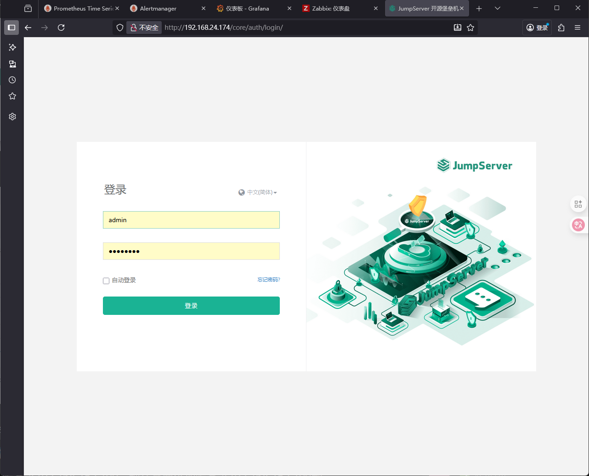
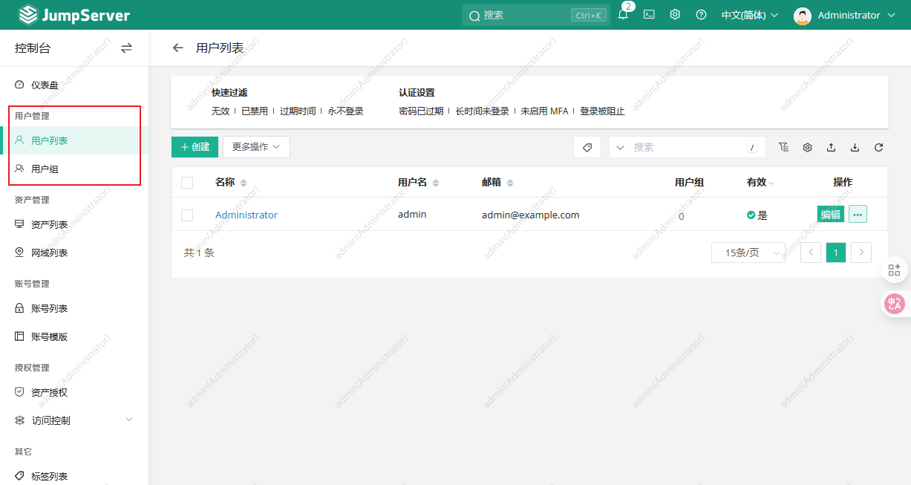
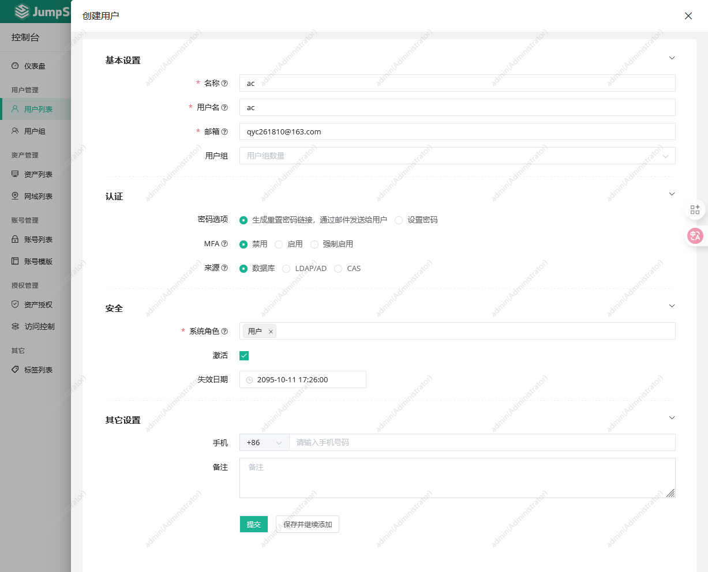

# JumpServer堡垒机

在以前运维场景中，几乎所有的运维人员可以调用 root 权限。如果想进行如 rm -rf /*等高危命令的话是十分危险的，曾经就有运维人源因为情绪崩溃删除了系统导致进黑屋了。（以前说删库跑了，现在连库都删不了，牛马太可悲了）

这时就需要一个可以管理服务器权限，又可以记录审计操作的工具。堡垒机便用于此。JumpServer 是目前国内外最流行、最成熟的开源堡垒机方案之一。

## 安装

参考：

[开源社区 - FIT2CLOUD 飞致云](https://community.fit2cloud.com/#/products/jumpserver/getstarted)

## 使用

登录 ```http:/<Jumpserver server IP>``` 进行登录，一般的，默认用户和密码会在安装完成后打印。



### 用户管理

在用户管理中可以管理 JumpServer 用户和 JumpServer 用户组，注意：是 JumpServer 的用户而便是 Linux 服务器的用户。



