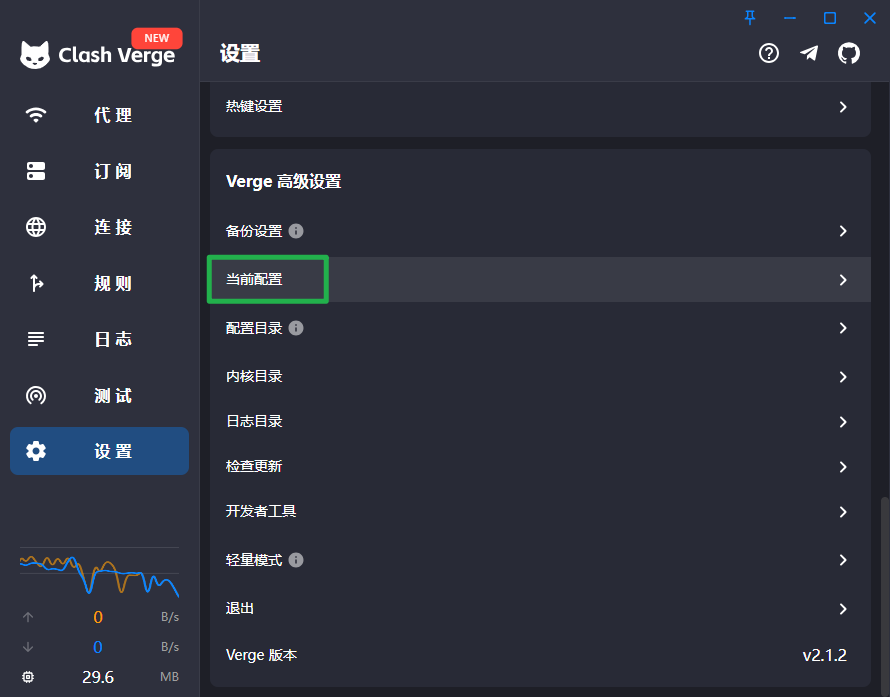
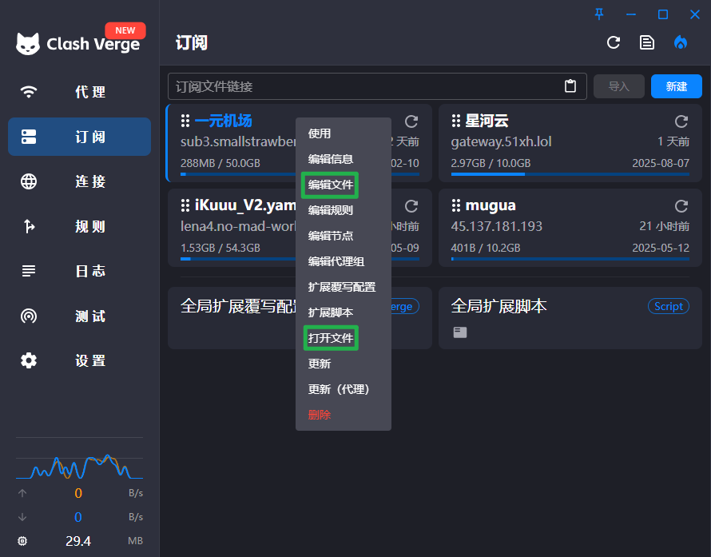
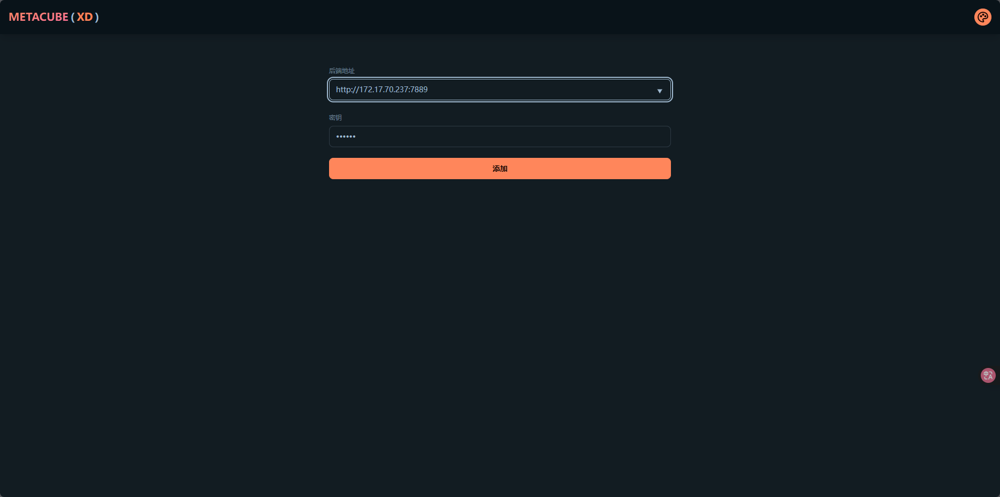
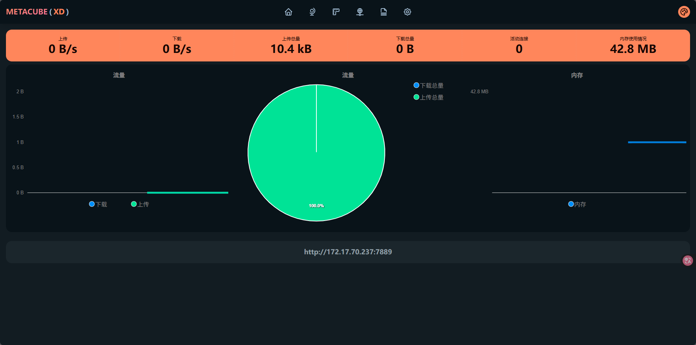

首先需要准备以下安装包

```bash
[root@localhost clash]# ll
总用量 42696
-rw-r--r--. 1 root root  9150220  5月 14 06:43 geoip.metadb
-rw-r--r--. 1 qyc  qyc   1253235  5月 14 20:50 metacubexd-1.187.1.tar.gz
-rw-r--r--. 1 root root 32055444  5月 13 12:28 mihomo-linux-amd64-v1.19.8.gz
```

以下为 github 连接，可自行下载最新版

mehomo：[https://github.com/MetaCubeX/mihomo/releases](https://github.com/MetaCubeX/mihomo/releases)

geoip：[https://github.com/MetaCubeX/meta-rules-dat](https://github.com/MetaCubeX/meta-rules-dat)

metacubexd：[https://github.com/MetaCubeX/metacubexd/releases](https://github.com/MetaCubeX/metacubexd/releases) 直接拉取命令：

```bash
wget <https://github.com/MetaCubeX/mihomo/releases/download/v1.19.8/mihomo-linux-amd64-go120-v1.19.8.gz>
wget <https://github.com/MetaCubeX/metacubexd/archive/refs/tags/v1.187.1.tar.gz>
wget <https://ghproxy.cn/https://github.com/MetaCubeX/meta-rules-dat/releases/download/latest/geoip.metadb>
```

解压文件

```bash
gzip mihomo-linux-amd64-go120-v1.19.8.gz
mv mihomo-linux-amd64-go120-v1.19.8.gz mihomo
tar xfz metacubexd-1.187.1.tar.gz
```

创建程序目录并拷贝文件

```bash
mkdir /opt/clash/
cp -rp mihomo metacubexd-1.187.1 geoip.metadb /opt/clash/
cd /opt/clash/
```

在 clash 的目录下创建 config.yaml 文件，

mihomo 兼容 clash，所以可以直接把 clash 的文件复制过来



或



由于牵扯到订阅文件,在此文件就不放全了

```bash
vim config.yaml
mixed-port: 7890 #Clash监听的端口
allow-lan: true
bind-address: '*'
mode: rule
log-level: info
external-controller: '0.0.0.0:7889' #开放的端口和允许访问的IP
external-ui: /opt/clash/ui #外部UI的路径
secret: "" #密钥，空位不需要密码
dns
    enable: false
    ipv6: false
    default-nameserver: [223.5.5.5, 119.29.29.29]
		............
```

添加配置

注意普罗米修斯接口也使用 9090 端口，如有使用请改为其他端口，流量一般会走 7890，7891……端口，所以也不要改这些端口，我改的是 7889 端口，一般需要添加：

```bash

external-controller: '0.0.0.0:9090'
external-ui: /opt/clash/ui 
```

如果要修改流量出端口（不推荐）

```bash
mixed-port: 7890#默认端口
socks-port: 7891#socks端口
port: 7892#http端口
```

将 metacubexd 内容复制到./ui/

```bash
cp -rp metacubexd-1.187.1/* ui/
rm -rf metacubexd-1.187.1
```

查看是否有执行权限，没有权限则使用 chmod +x mihomo 添加权限，cache.db 为缓存文件，不用在意。

```bash
[root@localhost clash]# ll
总用量 40308
-rwxr-xr-x. 1 root root    32768  5月 15 07:58 cache.db
-rwxr-xr-x. 1 root root    33768  5月 15 08:24 config.yaml
-rwxr-xr-x. 1 root root  9150220  5月 14 23:58 geoip.metadb
-rwxr-xr-x. 1 root root 32055444  5月 14 20:48 mihomo
drwxr-xr-x. 4 root root     4096  5月 14 23:01 ui
```

防火墙放行端口

```bash
setenforce 0
firewall-cmd --add-port=9090/tcp --permanent
firewall-cmd --reload
```

配置系统服务

```bash
[root@localhost qyc]# vim /etc/systemd/system/clash.service
[Unit]
Description=Clash
After=network.target NetworkManager.service systemd-networkd.service iwd.service

[Service]
Type=simple
LimitNPROC=500
LimitNOFILE=1000000
CapabilityBoundingSet=CAP_NET_ADMIN CAP_NET_RAW CAP_NET_BIND_SERVICE CAP_SYS_TIME
AmbientCapabilities=CAP_NET_ADMIN CAP_NET_RAW CAP_NET_BIND_SERVICE CAP_SYS_TIME
Restart=always
ExecStartPre=/usr/bin/sleep 1s
ExecStart=/opt/clash/mihomo -d /opt/clash
ExecReload=/bin/kill -HUP $MAINPID

[Install]
WantedBy=multi-user.target

```

开启 mihomo

```bash
systemctl daemon-reload
systemctl start clash
systemctl restart clash

```

访问访问 [http://](http://172.17.70.237:9100/)[localhost](http://localhost:9090/)[:9090/ui](http://172.17.70.237:9100/) 查看,默认有个登录界面



密码在 config.yaml 中可改



写一个脚本,让系统支持 Tun，每次使用的时候执行

```bash
vim [mihomo.sh](<http://mihomo.sh/>)
sysctl -w net.ipv4.ip_forward=1
sysctl -w net.ipv6.conf.all.forwarding=1
export http_proxy=http://127.0.0.1:7890
export https_proxy=http://127.0.0.1:7890
export all_proxy=socks5://127.0.0.1:7890
```

如果想直接写入系统文件

```bash
echo "net.ipv4.ip_forward = 1" >> /etc/sysctl.conf
echo "net.ipv6.conf.all.forwarding = 1" >> /etc/sysctl.conf
```

参考：

[https://12520.net/archives/debian-mihomo-clash.mate-webui](https://12520.net/archives/debian-mihomo-clash.mate-webui)

[https://zfxt.top/posts/70b7a805/index.html](https://zfxt.top/posts/70b7a805/index.html)

[https://zhichao.org/posts/c4fc1f](https://zhichao.org/posts/c4fc1f)