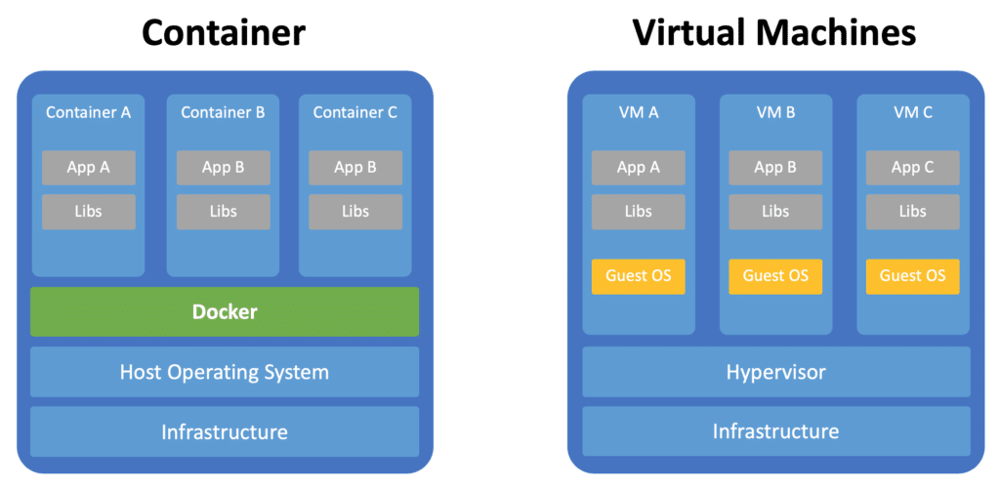
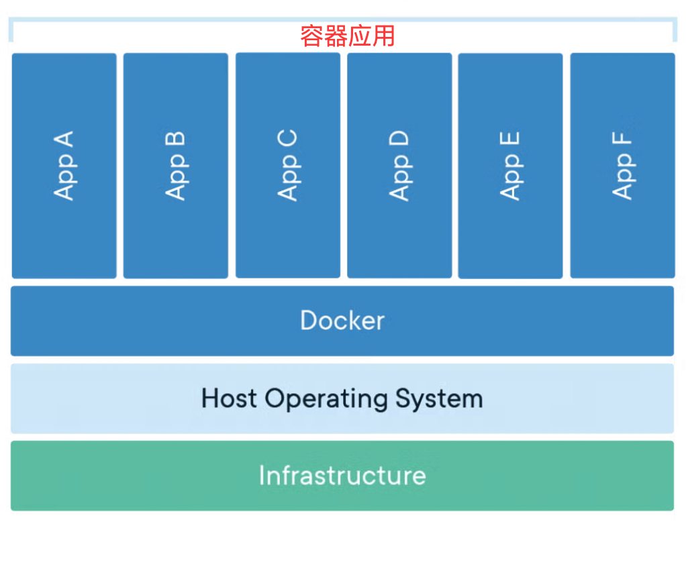
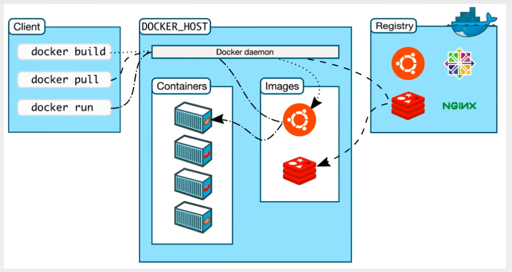

# Docker基础概念

---

## 什么是Docker？

Docker是一个开源的应用容器化平台。使用GO语言开发，于2013年首次发布。（Docker不等于容器）

---

## 容器化技术

容器（Container）本质上是一种`轻量级的虚拟化技术`，它通过操作系统内核的功能（主要是 Linux 的 **namespace** 和 **cgroups**）来实现进程隔离和资源限制。

### 虚拟机与容器

在容器技术之前主流使用的技术是虚拟机（VM）。通过在物理机上安装 Hypervisor（虚拟机管理器）来管理虚拟机，虚拟出一套虚拟硬件来运行虚拟机，每个虚拟机都需要运行一个完整的OS，再运行应用。这使得传统虚拟机运行应用启动慢，性能开销大，占资源大，但隔离是硬件级的。

**容器共享主机内核，只隔离用户空间，每个容器内都有属于自己的文件系统，之间互不影响。启动快，性能开销小，占资源少。**

容器拥有很强可移植性，容器可以让不同的应用和与之相关的环境可以像“盒子”一样被打包、运行。这使得应用在迁移到其他主机时环境可以一起迁移，以减少环境不同对运行应用造成的影响，同时也可以更容易更快速的部署应用。

### **容器 VS 虚拟机架构**

### Docker 容器的基本架构

- 上层 是多个容器（App A~F），每个容器独立运行一个应用。
- 中间层 是 Docker，负责管理这些容器。
- 底层 是主机操作系统（Host OS）和基础设施，为容器提供硬件和系统支持。

---

## Docker架构

Docker 采用C/S  (客户端-服务端) 架构，这种设计使得可以使用 Docker 客户端与本地或远程的 Docker 守护进程进行通信。

其架构可以分为Docker Client（Docker客户端），Docker Host（Docker主机），Docker Registry（ Docker仓库）三个部分。

### Docker Client（Docker客户端）

Docker 客户端是用户与 Docker 的主要交互入口，当用户在CLI中输入`docker run`、`docker build`等命令时，实际上是在使用Docker 客户端。

它负责将你的命令转换成REST API 发送给Docker 守护进程。

---

### Docker Host（Docker主机）

Docker 主机是安装了 Docker 引擎并运行 Docker 守护进程的物理机或虚拟机，它提供了运行和管理容器所需的所有环境。

---

### Docker Daemon（Docker 守护进程）

Docker 守护进程是Docker 引擎的核心，运行在主机操作系统上的后台服务，进程名为 `dockerd`。

它负责监听来自Docker客户端的 REST API 请求，与仓库通信，并对容器，镜像，网络和数据卷……进行管理。

---

### REST API（表述性状态转移 应用程序接口）

REST API是Docker所提供的API接口，客户端与 Docker 守护进程便是使用REST API进行通信的，用户可以通过REST API对Docker进行相应的操作。

- REST

REST并不是这个API的名字，而是一种架构风格，由Roy Fielding在2000年提出。
REST基于HTTP协议，因此也拥有一些HTTP的特性，例如：

无状态性，统一接口，C/S架构……

它也使用HTTP的方法进行操作，例如：

`GET` → 获取资源

`POST` → 新建资源

`PUT` → 更新资源

`DELETE` → 删除资源

……

详细可见[REST API 教程](https://www.runoob.com/w3cnote/rest-api-tutorial.html)

因为遵循了REST API这套标准，所以不仅 Docker客户端可以和Docker守护进程通信，任何支持HTTP 的程序都可以通过同样的方式来自动化地管理Docker，使得Docker的生态变得非常强大和灵活。

---

### Images（镜像）

Docker镜像是一个只读的模板，包含了运行应用程序所需的代码、运行时环境、库、环境变量和配置文件。镜像是分层构建的，每一层都代表Dockerfile中的一条指令。通过镜像可以构建出容器。

- 分层存储：镜像由多个层组成，每一层代表一次修改
- **只读性**：镜像本身是只读的，不能直接修改
- **可复用**：同一个镜像可以创建多个容器
- **版本管理**：通过标签(tag)进行版本管理

---

### Compose（容器）

容器是镜像的运行实例。通过镜像创建，并在宿主机中以独立进程运行，与宿主机和其他容器共享内核。

- **隔离性**：每个容器都有自己的文件系统、网络和进程空间
- **临时性**：容器可以被创建、启动、停止、删除
- **可写层**：容器在镜像基础上添加了一个可写层
- **进程级**：容器内通常运行一个主进程

---

### **Docker** Networks（Docker 网络）

Docker 网络负责容器与其他容器和外界网络的通信。

容器默认启用网络功能，一个容器可以连接到多个网络。容器对它连接的网络类型没有信息，也无法判断其同伴是否也是 Docker 工作负载。容器只看到一个带有 IP 地址、网关、路由表、DNS 服务和其他网络细节的网络接口。

Docker为其提供了五种网络驱动程序分别是：

bridge（桥接模式）（默认使用）

host（主机模式）

none（无网络）

overlay（跨主机）

ipvlan

macvlan

---

### ****Volumes（数据**卷**）

容器总是临时性的，如果容器被删除，数据也会消失。数据卷是一种数据持久化机制，并能在容器和宿主机之间、容器和容器之间共享数据。卷的内容不会随着容器的销毁而丢失，适用于数据库等需要持久存储的应用。

---

### Docker Registry（ Docker仓库）

仓库用于用于存储和分发镜像。分为公共仓库，私有仓库。

- 公共仓库：如Docker Hub，任何人都可以使用。
- 私有仓库：企业内部部署的 Registry。

**Registry vs Repository**：

- **Registry**：仓库注册服务器，如 Docker Hub。
- **Repository**：具体的镜像仓库，如 nginx、mysql。

---

### Docker Engine（Docker 引擎）

Docker Engine 是 Docker 的运行核心，是一个 C/S 架构的应用，包括Docker 守护进程，REST API，Docker客户端三个部分。

---

## Docker的交互过程

例如用户输入了`docker run nginx`，以下是交互的过程：

1. Client →REST API → Daemon（客户端 →REST API  →守护进程 ）

当用户输入`docker run nginx`命令时，客户端 对命令进行解析，通过 **REST API** 发给守护进程。

1. Daemon → Registry→Images （守护进程→仓库→镜像）

守护进程对本地镜像进行检索，如果本地没有nginx镜像，则会从仓库拉取镜像。

1. Daemon → Images →Containers（守护进程→ 镜像→容器）

本地拥有镜像后，使用镜像创建一个容器进程，并对其挂载存储、配置网络、分配 IP、开放端口……。

---

## **Docker Swarm**

Docker Swarm 是 Docker 官方提供的 容器编排工具。它能把一群运行 Docker 的机器（节点）组织成一个 集群（Swarm 集群），并进行管理管理。

类似Kubernetes？当然本篇笔记不会多Docker Swarm进行过多的讲解，主要还是Kubernetes。

---

## 参考

文章资料：

https://www.runoob.com/docker/docker-intro.html

https://zh.wikipedia.org/wiki/%E5%AE%B9%E5%99%A8_(%E8%99%9A%E6%8B%9F%E5%8C%96)
https://docs.docker.com/manuals/
https://docs.docker.com/engine/

https://blog.csdn.net/leah126/article/details/131871717

使用AI：

Gemini 2.5 Pro

ChatGPT-5

Claude 4
