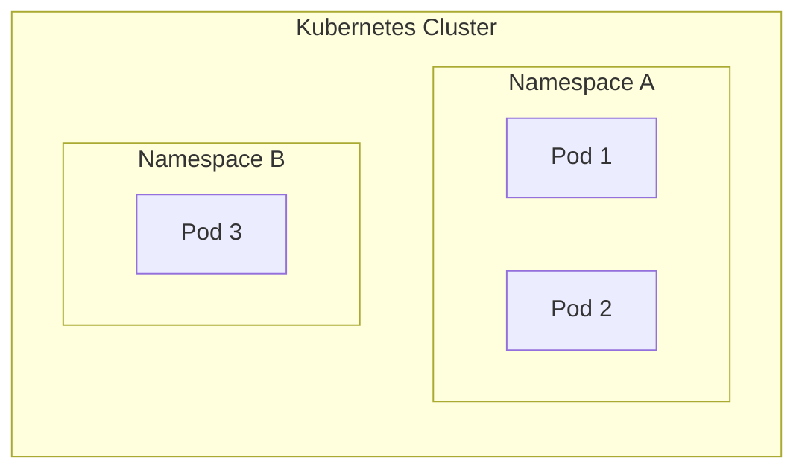
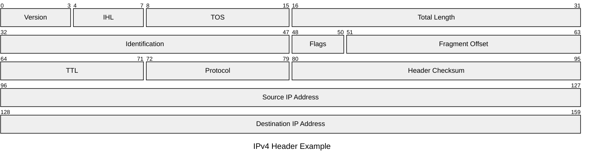

# Linux Namespace（命名空间）

Linux Namespace 是由 linux 内核所提供的资源隔离机制，它可以将不同的资源放入同一个 Namespace 当中对其进行隔离，并且可以对一些运行需要的系统资源实现虚拟化，Namespace 与其他 Namespace 之间的资源互不干扰。

例如可以将 PID 放入到不同的 Namespace 中，可以看到不同的 Namespace 中可以有相同的 PID。（所以我们说的 PID 不能相同其实是同一个 Namespace 中的 PID 不能相同）





## 种类

Linux 中支持多种不同种类的 Namespace。

|Namespace|系统调用标识|隔离内容|容器中的作用|
|---|---|---|---|
|**UTS**|`CLONE_NEWUTS`|主机名和域名|每个容器有自己的 `hostname`|
|**PID**|`CLONE_NEWPID`|进程号|容器里 `ps` 只能看到自己容器的进程|
|**NET**|`CLONE_NEWNET`|网络设备、IP、路由|每个容器有自己的网络栈|
|**MNT**|`CLONE_NEWNS`|挂载点|容器有自己的文件系统视图|
|**IPC**|`CLONE_NEWIPC`|进程间通信（消息队列、信号量、共享内存）|防止容器间 IPC 干扰|
|**USER**|`CLONE_NEWUSER`|用户和组 ID|容器内 `root` 不等于宿主机 root|
|**Cgroup**|`CLONE_NEWCGROUP`|Cgroup 层级|限制容器能访问的 cgroup 范围|

## 相关命令

使用 `insn` 命令可以查看系统的 Namespace 列表。

```bash
[ root@localhost qyc]# lsns
        NS TYPE   NPROCS   PID USER   COMMAND
4026531834 time      296     1 root   /usr/lib/systemd/systemd rhgb --switched-r
4026531835 cgroup    296     1 root   /usr/lib/systemd/systemd rhgb --switched-r
4026531836 pid       296     1 root   /usr/lib/systemd/systemd rhgb --switched-r
……
```

可以通过查看`/proc/<PID>/ns` 中的文件查看进程所属的 Namespace。

```bash
[ root@localhost qyc]# ls  -al /proc/1150/ns/
总用量 0
dr-x--x--x. 2 root root 0  9 月 13 08:16 .
dr-xr-xr-x. 9 root root 0  9 月 13 08:16 ..
lrwxrwxrwx. 1 root root 0  9 月 13 08:16 cgroup -> 'cgroup:[4026531835]'
lrwxrwxrwx. 1 root root 0  9 月 14 13:44 ipc -> 'ipc:[4026531839]'
lrwxrwxrwx. 1 root root 0  9 月 14 13:44 mnt -> 'mnt:[4026531841]'
lrwxrwxrwx. 1 root root 0  9 月 14 13:44 net -> 'net:[4026531840]'
lrwxrwxrwx. 1 root root 0  9 月 14 13:44 pid -> 'pid:[4026531836]'
lrwxrwxrwx. 1 root root 0  9 月 14 13:56 pid_for_children -> 'pid:[4026531836]'
lrwxrwxrwx. 1 root root 0  9 月 14 13:44 time -> 'time:[4026531834]'
lrwxrwxrwx. 1 root root 0  9 月 14 13:56 time_for_children -> 'time:[4026531834]'
lrwxrwxrwx. 1 root root 0  9 月 14 13:44 user -> 'user:[4026531837]'
lrwxrwxrwx. 1 root root 0  9 月 14 13:44 uts -> 'uts:[4026531838]'
```

使用 `unshare` 命令可以创建并进入一个新的 Namespace。

`--pid`: 创建新的 PID namespace

`--fork`: 在新的 PID namespace 中创建子进程

`--mount-[文件]`: 将文件系统作为 private 挂载

`--uts`: 创建新的 UTS namespace

……

```bash
#查看当前主机名
[ root@localhost qyc]# hostname
localhost.localdomain

#创建一个 bash namespace
[ root@localhost qyc]# unshare --uts bash
#更改并查看主机名为 qyc 2
[ root@localhost qyc]# hostname qyc2
[ root@localhost qyc]# hostname
qyc 2
#退出使用 exit 或者 ctrl+D
[ root@localhost qyc]# exit

#再次查看主机名，可以发现又变回了原来的主机名
[ root@localhost qyc]# hostname
localhost.localdomain
```

一般而言，当 namespace 中没有进程时，内核变会自动删除 namespace，例如刚才当我们使用 exit 退出 bash 后，namespace 便会被自动删除了，如有需要，可以使用 `kill` 手动删除进程，使其关闭。

使用 `ip netne add` 可以创建网络 Namespace。

---

# Cgroup（控制组）

Cgroup 的全称为 Control Group，是 Linux 内核提供的一种资源管理机制。它对进程进行型分组，并进行相应的资源管管理。以防止各各进程互相抢占资源。在 2.6 版本内核当中 Cgrup 被初次引入，目前有 v 1 和 v 2 两个版本，在此非说明为 cgroup v 2，默认 cgroup 为 v 1。

## 相关概念

### 任务（Task）

在 cgroup 中，一个任务就是一个进程。

### 控制组(control group)

控制组内可以包含一组任务（进程）和与之相关的资源限制规则，cgroup 的资源控制是以控制组的方式实现。

### 层级(hierarchy)

层级是树型结构，一个层级由多个控制组组成，每个层级上可以附加一个或多个子系统。系统可以有多个层级，子节点的控制组继承父控制组的属性(资源配额、限制等)。可以使用 `mount | grep cgroup` 命令来查看层级

```bash
[root@localhost qyc]# mount | grep cgroup
cgroup2 on /sys/fs/cgroup type cgroup2 (rw,nosuid,nodev,noexec,relatime,seclabel,nsdelegate,memory_recursiveprot)
cgroup=test on /home/qyc/qyc/cgroups type cgroup (rw,relatime,seclabel,name=cgroup-test)
```

### 子系统(subsystem)

子系统也称资源控制器，可以关联至控制组当中用于管理一类资源，例如 CPU 子系统用于管

## cgroup 核心

主要负责以分层方式组织进程

## 子系统

查看 `/proc/cgroups` 文件可以看到内核支持的子系统。

其他系统可以尝试下载 `libcgroup-tools` 使用 `lssubsys -a` 查看，我这的官方源已经把 `libcgroup-tools` 给移除了（貌似是更新了 Cgroup v 2 的原因，不适用了）。

```bash
[root@localhost qyc]# cat /proc/cgroups
#subsys_name    hierarchy       num_cgroups     enabled
cpuset  0       289     1
cpu     0       289     1
cpuacct 0       289     1
blkio   0       289     1
memory  0       289     1
devices 0       289     1
freezer 0       289     1
net_cls 0       289     1
perf_event      0       289     1
net_prio        0       289     1
hugetlb 0       289     1
pids    0       289     1
rdma    0       289     1
misc    0       289     1

```

|子系统|功能|
|---|---|
|**cpu**|限制/统计 CPU 时间|
|**cpuacct**|统计 CPU 使用情况|
|**cpuset**|绑定进程到特定 CPU/NUMA 节点|
|**memory**|限制/统计内存使用，支持 OOM 控制|
|**blkio**|限制块设备 I/O（磁盘读写速率）|
|**devices**|控制进程能访问的设备（如禁止访问 `/dev/sda`）|
|**freezer**|暂停/恢复进程组|
|**net_cls / net_prio**|限制网络带宽，设置优先级|
|**hugetlb**|控制 HugeTLB 内存分配|

## cgroup v 2

使用 `stat -fc %T /sys/fs/cgroup/` 命令可以查看 cgroup 的版本，输出为 cgroup 2 fs 那便是 cgroup v 2 版本，输出位 tmpfs 那便是 cgroup v 1 版本。

```bash
[root@localhost qyc]# stat -fc %T /sys/fs/cgroup/
cgroup2fs
```

cgroup v 1 与 cgroup v 2 最大的区别便是 cgroup v 1 允许创建多个，独立的层级，而 cgrop v 2 中只允许创建一个层级。

一些系统默认会为一个子进程创建一个层级，因此在 cgroup v 1 中可以看到 `/sys/fs/cgroup/cpu`，`/sys/fs/cgroup/memory` 这样的的文件在 cgroup v 2 中就没有了。

## cgroup 文件

cgroup 通过一个特殊的虚拟文件系统作为接口，将进程进行分组，并让内核中的各种资源控制器（子系统）对这些分组实施监控和限制。虚拟文件夹系统通常被系统挂载在 `/sys/fs/cgroup` 目录下。挂载的位置基即整个层级的跟节点。

`cgroup.procs` 文件用于存放当前控制组中所有进程的 PID。

`tasks` 文件会存储当前加入控制组线程的 TID，如果将相应的 TID 写入到这个文件，就会将相应的线程加入到这个控制组中。

在 Linux 中每个线程都有唯一的 ID，称为 TID (Thread ID)。从内核的角度看，线程是调度的基本单位。我们通常所说的进程 ID（PID）实际上是该进程主线程的 TID。因此 tasks 文件可以支持更加精细化的管理。

`cgroup.clone_children` 文件用于开启或关闭子系统继承，0 不继承，1 继承。默认为 0。

`notify_on_release` 用于开关自动清理，0 不清理，1 清理 ，默认为 0。

## cgroup 实验

由于使用的是 CentOS-Stream-9，所以在这里使用的是 cgroup v 2（懒得装）

使用 `mount -t cgroup -o none,name=cgroup-test cgroup=test [挂载位置]`，可以对 cgroup 的虚拟文件进行挂载

```bash
[root@localhost qyc]# mkdir cgroups
[root@localhost qyc]# mount -t cgroup -o none,name=cgroup-test cgroup=test ./cgroups/
mount: /home/qyc/qyc/cgroups: cgroup=test 已挂载于 /home/qyc/qyc/cgroups.
[root@localhost qyc]# cd cgroups/
[root@localhost cgroups]# ll
总用量 0
-rw-r--r--. 1 root root 0  9月 14 17:56 cgroup.clone_children
-rw-r--r--. 1 root root 0  9月 14 17:56 cgroup.procs
-r--r--r--. 1 root root 0  9月 14 17:56 cgroup.sane_behavior
-rw-r--r--. 1 root root 0  9月 14 17:56 notify_on_release
-rw-r--r--. 1 root root 0  9月 14 17:56 release_agent
-rw-r--r--. 1 root root 0  9月 14 17:56 tasks
```

使用 `while true;do echo;done;` 命令可以跑满 cpu（大抵）。此时在新建的页面使用 `top` 可以查看进程占用。

此时的这个进程的的 cpu 使用率到达了的 72.8%

```bash
[root@localhost qyc]# top
……
    PID USER      PR  NI    VIRT    RES    SHR S  %CPU  %MEM     TIME+ COMMAND
 195520 root      20   0  224264   5632   3840 R  72.8   0.1   0:35.50 bash
……
```

查看 shell 脚本的进程 ID

```bash
[root@localhost cgroup]# echo $$
195520

```

创建 test 文件

```bash
[root@localhost cgroup]# mkdir test
[root@localhost cgroup]# cd test/
[root@localhost test]# ls
cgroup.controllers               hugetlb.1GB.events        memory.oom.group
cgroup.events                    hugetlb.1GB.events.local  memory.peak
cgroup.freeze                    hugetlb.1GB.max           memory.reclaim
……
```

将进程号写入文件当中，即将进程加入到控制组当中

```bash
 [root@localhost cgroup]#echo 195520 > ./cgroup.procs
 [root@localhost cgroup]# cat cgroup.procs | grep 195520
195520
```

在 cpu.max 中修改 `[限制的上限] 100000`，便可以修改 cpu 的使用率上线，50000 即上限 50%，100000 即上限 100%，MAX 也是 100%（这关于 cpu 的调度周期），

```bash
[root@localhost test]# echo "50000 100000" > /sys/fs/cgroup/test/cpu.max

```

再次运行脚本，使用 top 查看可以发现进程的资源占用被限制在了 50%了。

```bash

[root@localhost qyc]# top
……
    PID USER      PR  NI    VIRT    RES    SHR S  %CPU  %MEM     TIME+ COMMAND
 195520 root      20   0  224524   6016   4096 R  50.0   0.1   4:53.91 bash
……
```

---

# UnionFS（联合文件系统）

就如字面意思一样，UnionFS 可以将多个目录联合起来，成为一个统一的视图。

## AUFS（待写）

注意：较新的内核不支持 AUFS（也可以手动装），所以推荐使用较为旧版本的 Linux。

## OverlayFS

OverlayFS 是 Linux 内核中的一种 UnionFS，Overlay 使用内核中的 VFS 层来进行联合 (Virtual File System)，被联合的 1 个目录被称为“层“（Layer），OverlayFS 在 3.18 版本被首次引进。

分层的优势就像 Docker 一样，多个容器需要使用同一个镜像（lowedir）中时，容器们可以共享一个 lowedir 层，每个容器运行只需要占用自己的 upperdir 层即可，这样便可以减少使用的空间。同样的创建一个容器不需要复制一个 lowedir 层这样便加快了部署速度。

### OverlayFS 的目录

lowerdir：只读层，底层的目录，可以有一个或者多个。

upperdir：可写层

workdir：OverlayFS 的工作目录，这是一个内部目录。

merget：统一视图目录，联合制后的目录。

### OverlayFS 的创建

```bash
mount -t overlay overlay \\
  -o lowerdir=/lower,upperdir=/upper,workdir=/work \\
  /merged
```

### OverlayFS 的工作

- 读取：

如果文件存在于 upperdir，则直接读取 upperdir 的内容。

否则从 lowerdir 读取内容。

- 写入：

如果文件存在于 upperdir 中，则直接写入文件。

如果文件存在于 lowerdir 中，则会复制一份文件到 lowedir 中。这个技术叫做 Copy-on-Write。

- 创建：

创建的文件会被放入 upperdir 中。

- 删除：

如果要删除 lowerdir 中的文件，OverlayFS 则会创建一个“白障”文件（whiteout），白障文件可以隐藏掉”被删除“的文件，原始文件依然在 lowerdir 中，只是被隐藏了起来。

---

## 在 Docker 中的应用

不难看出：

- Docker 容器看起来像一个独立的系统，其实是使用 Namespace 隔离的结果。使得容器安全，可控。
- Cgroup 则用于限制容器的资源占用，防止例如"超售"等情况的发生。使得容器安全，可控。
- Docker 镜像则是容器 UnionFS 的只读层，UnionFS 会将这些只读层堆叠在一起，形成一个统一的文件系统视图。容器则在只读层上使用可写层，当容器修改文件时它不会改变镜像的只读层，而是将变更复制到最上方的可写层进行操作。使得容器快速，轻量。

这三者共同构成了容器技术的核心。

---

# 参考

文章资料：

[https://zhuanlan.zhihu.com/p/257954941](https://zhuanlan.zhihu.com/p/257954941)

[https://zhuanlan.zhihu.com/p/73248894](https://zhuanlan.zhihu.com/p/73248894)

[https://docs.linuxkernel.org.cn/admin-guide/cgroup-v2.html](https://docs.linuxkernel.org.cn/admin-guide/cgroup-v2.html)

[[技术]Docker 核心原理 第 2 期 CGroups _哔哩哔哩_ bilibili](https://www.bilibili.com/video/BV1z34y1Z7yq/?spm_id_from=333.1007.top_right_bar_window_history.content.click&vd_source=6a688cd548533c0b00d38cf95f81acbf) [(3 封私信 / 80 条消息) 浅谈Linux Cgroups机制 - 知乎](https://zhuanlan.zhihu.com/p/81668069) [https://arthurchiao.art/blog/cgroupv2-zh/#122-进程线程与-cgroup-关系](https://arthurchiao.art/blog/cgroupv2-zh/#122-%E8%BF%9B%E7%A8%8B%E7%BA%BF%E7%A8%8B%E4%B8%8E-cgroup-%E5%85%B3%E7%B3%BB)

[Linux-Cgroup V2 初体验 - 探索云原生 - SegmentFault 思否](https://segmentfault.com/a/1190000045052990)

使用 AI： ChatGPT-5

Gemini 2.5 Pro

Claude 4

编写：

2025.9.14-~2025.9.18 春风

修改：

2025.10.6 春风 增加了在 Docker 中的应用。