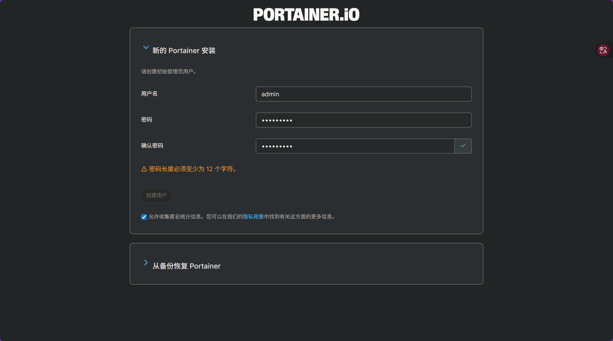

# **portainer安装**

Portainer是一款开源、轻量级的容器管理图形用户界面（GUI），在这里即给docker装上web。

创一个数据卷来给portainer存放信息。

```bash
docker volume create portainer_data
```

下载并运行portainer CE容器。

```bash
docker run -d \
  -p 8000:8000 \
  -p 9443:9443 \
  --name portainer \
  --restart=always \
  -v /var/run/docker.sock:/var/run/docker.sock \
  -v portainer_data:/data \
  portainer/portainer-ce:latest
```

访问[https://localhost:9443](https://localhost:9443/)查看。

因为 Portainer 默认使用自签名 SSL 证书，浏览器可能发出安全警告。

设置密码


