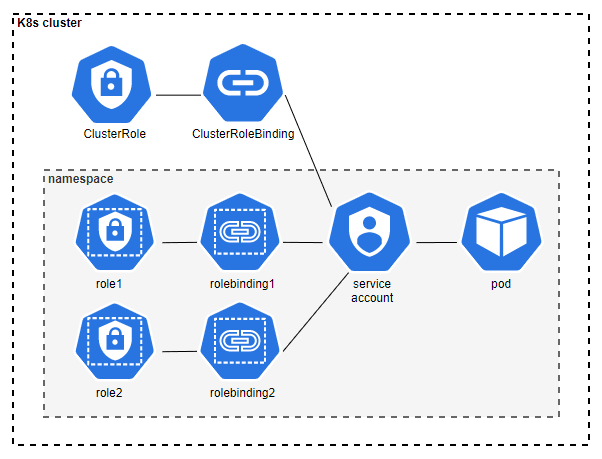
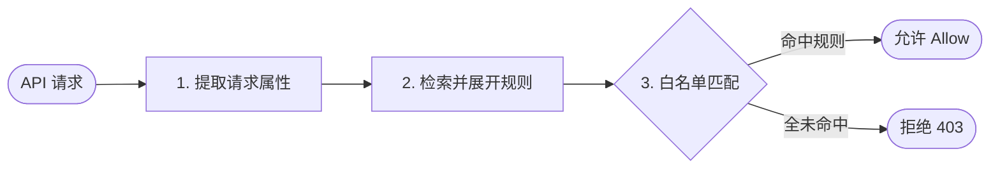

# k8s 鉴权

Kubernetes 的所有操作都是通过 API Server 进行的，API Server 需要对 API 请求进行鉴权以保证集群的安全性，同时 k 8 s 是多租户的，鉴权可以把一个租户的权限控制在自己的 namespace 内。

## RBAC（Role-Based Access Control，基于角色的访问控制）

RBAC是一种主流的权限管理模型，其权限分配方式为：将``权限``分配给``角色``,将``角色``绑定给``主体``。一个主体可以有多种角色。

> RBAC不仅仅用在k8s上，他是一种权限设计模型或者说模板，所有关于权限管理的设计时，都可以参考这个模板，做类似这个结构的权限管理。



- **主体(Subject)**

主体也叫对象，是发起API请求的实体，其包括了``用户``,``用户组``和``服务账号``，服务账号是K8s 内部专门给 Pod 和程序使用的账号。类似linux中专门给服务创建的用户类似。

- **权限规则(Rule)**

字面意思，由``资源+操作组成``，例如拥有对资源A的读权限。

- **角色**

角色本质上是一堆权限规则的集合，可以与主体进行绑定，范围限定在namespace。角色可以分为``Role``和``ClusterRole``两类。可以想象为一个主体是一个员工，k8s为公司，而角色便是这个员工在公司中扮演着什么职位，拥有着什么权限。一个员工可以在公司扮演着多个职位，可以拥有多个职位的权限，即一个主体可以绑定多个角色。（复合型nm吗？）

**Role**：

命名空间级别的角色，它只能定义某个特定命名空间内的资源权限。

**ClusterRole**：

集群级别的角色，可以定义集群级别的资源的权限，可以作为一种全局的通用权限模板在整个集群内复用。

- 绑定

绑定就是把``角色``发给``主体``的动作。一个主体可以绑定多个角色。绑定又可以分为``RoleBinding``和``ClusterRoleBinding``。

**RoleBinding**：

在特定命名空间内生效。它可以绑定一个Role，也可以绑定一个ClusterRole，但作用域会被死死限制在当前命名空间内。

**ClusterRoleBinding**：

在整个集群范围内生效。它只能绑定ClusterRole，一旦绑定，该主体就拥有了集群内所有命名空间下该角色的权限。

## RBAC 鉴权过程



## RBAC的配置

使用使用 ``kubeadm`` 部署的集群，默认 RABC 是开启的。

可以使用以下命令查看进程，确定是否 RABC 是否为开启。
```bash
ps aux | grep kube-apiserver | grep authorization-mode
```

先创建一个命名空间

```bash
kubectl create namespace rbac-demo-ns
```

编写 role

```yaml
apiVersion: rbac.authorization.k8s.io/v1
kind: Role
metadata:
  namespace: rbac-demo-ns  # 所属 rbac-demo-ns 命名空间
  name: pod-manager
rules:
- apiGroups: [""]        # 留空 "" 表示核心 API 组，Pod 属于这里
  resources: ["pods"]    # 资源名称，必须是复数形式
  verbs: ["get", "list", "watch", "create"] # 允许的操作
```

编写 RoleBinding

```yaml
apiVersion: rbac.authorization.k8s.io/v1
kind: RoleBinding
metadata:
  name: bind-tom-pod-manager # 绑定名称
  namespace: rbac-demo-ns  # 必须和 Role 在同一个命名空间
subjects:
- kind: User
  name: tom               # 名字大小写敏感
  apiGroup: rbac.authorization.k8s.io
roleRef:
  kind: Role              # 只能引用同命名空间下的 Role（或特殊的 ClusterRole）
  name: pod-manager       # 对应上面创建的 Role 的名字
  apiGroup: rbac.authorization.k8s.io
```

编写 ClusterRole

```bash
apiVersion: rbac.authorization.k8s.io/v1
kind: ClusterRole
metadata:
  name: secret-reader-global # 集群角色不需要写 namespace
rules:
- apiGroups: [""]
  resources: ["secrets"]
  verbs: ["get", "list"]
```
