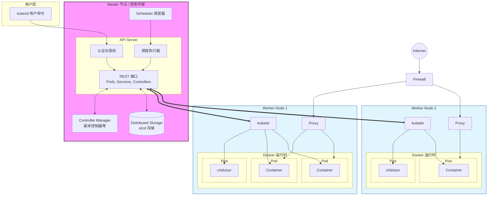

# k8s的架构

k8s采用的Master-Worker架构，整个架构分为控制层面和工作层面。控制层面负责管理整个集群，可以在集群的任意节点上部署。工作层面负责处理详细的容器运行。

---

---

## Kubectl

Kubectr是k8s的命令行工具，即不属于控制层面也不属于工作节点，类似于Docker Client。当使用kubectr命令时，kubetr会把这条命令翻译成HTTP REST API 请求发送到Kubernetes控制层面当中。

---

## 节点（node）

节点是在k8s中能运行pod的机器，物理机也好，虚拟机也好都可以是节点。通常节点上会运行kubelet，kube-proxy和Container Runtime。

---

## pod

pod是k8s中最小的调度单位，可以理解为容器组。通常一个pod只装载一个容器，以方便解耦。除非需要多个容器在一起的服务。

---

## 控制层面组件（Control Plane）

### Kube-APIServer

API Server使用REST API暴露了k8s的功能，负责处理所有的 REST 操作。用户和第三方程序都需通过使用它来与k8s交互。集群内部组件也通过它来访问k8s，例如Kubelet。它是整个集群所有交互的唯一入口点。

当使用kubectr命令时，kubetr提交请求。API server会对其进行认证授权的检擦（一般使用**RBAC** ），检擦合法后API Server会把请求放入etcd中并通知相应的组件进行操作。

### etcd

etcd是一种分布式键值存储系统，基于 Raft 协议。最初由CoreOS开放，后移交给CNCF管理。

- 作用

etcd是k8s的`数据库`，所有关于集群状态的数据，无论是期望状态（用户希望集群是什么样子）还是实际状态（集群当前是什么样子），都以键值对的形式持久化存储在 etcd 中。

当API Server接受请求后，API Server会把请求写入到etcd中，ctcd只与API Server通讯。

- 唯一可信

etcd是唯一可信的，这保证了有多个APL Server的情况可以共同使用一个etcd以避免状态分裂。

- Q：为什么需要放入etcd中？

A：当用户发送请求时，其实就是提出了一种期望状态，k8s需要完成一系列操作才能把期望状态变成实际状态。由于API Server被设计为了无状态（stateless）。这意味着API Server可以随时重启……，如果它把集群的状态信息保存在自己的内存里，一旦重启内存中的东西就会清空，发出的请求则会失效，集群信息就会丢失。所以需要一个持久化存储的功能存储期望状态和完成状态。

### kube-Scheduler

Scheduler负责监控和管理pod，是k8s的调度器。scheduler会监听API server，当发现有需要调度pod时，Scheduler会使用资源利用率，pod亲和度，自定义调度……标准对节点进行评判点，随后Scheduler会把pod分配在到一个合适的节点上运行，并将调度结果回复给API Server。

### kube-Controller Manager (控制器管理器)

Controller-Manager负责运行各种控制器进程。为了简化管理，通常这些控制器都写在同一个程序当中。

#### 控制器

- Node 控制器：监控节点健康，发现节点不可用时做出响应。
- Replication 控制器 / ReplicaSet 控制器：保证 Pod 副本数与期望一致。
- Deployment 控制器：支持滚动更新、回滚。
- Job 控制器：负责一次性任务。
- Endpoint 控制器：维护 Service 与 Pod 的映射。
- Namespace 控制器：清理命名空间下的资源。
- ServiceAccount 控制器：自动创建 ServiceAccount 和 token。

### kube-Cloud Controller Manager (云控制器管理器)

Cloud Controller Manager（CCM）是由Controller Manager（CM）所分离出来的，由于各云厂商的交互代码都有所不同，如果所有云厂商的交互代码都写在CM的文件里的话，会导致CM过于臃肿。

CCM的出现是为了让k8s与各个云服务厂商的交互组件进行解构，CCM允许将你的集群连接到云提供商的 API 之上， 并将与该云平台交互的组件同与你的集群交互的组件分离开来。

CCM只运行云厂商的控制器，CCM同CM一样也是将控制器都写在同一个程序当中。

### 控制器

- **Node 控制器**：检查云厂商 API，判断节点是否被删除/不可用。
- **Route 控制器**：为 Pod 网络配置路由（某些云环境需要）。
- **Service 控制器**：在云上创建/删除负载均衡器。
- **Volume 控制器**：动态分配和挂载云硬盘（Persistent Volume）。

---

## 工作节点组件（Worker Nodes）

### Kubelet

kubele在每个节点中运行。它会监听API Server ，并按照 API Server 下发的规范（PodSpec）对pod进行管理，确保容器一直按照预期运行，如果崩溃会尝试重启。PodSpec 里描述了 Pod 的容器、镜像、资源、探针等信息。Kubelet只管理由k8s创建的容器。

Kubelet还负责Pod的生命周期管理。使用用CRI（容器运行时接口）启动，停止容器。用CSI（容器存储接口）来管理卷。

Kubelet会定期向API Server汇报节点和pod的状态。

### Kube-proxy

kube-proxy也在每个节点中运行。是每个节点的网络代理理组件。

由于Pod总是临时的，重建Pod后，Pod的IP也会改变，Service提供了一个固定的虚拟IP来访问Pod。在这之中Kube-Proxy会把Service IP和Pod IP所关联起来。

### 转发原理

Kube-proxy会监听API Server，获取所有 Service 和 EndpointSlice 对象的最新变化

`Service` 对象：定义了哪个虚拟 IP (ClusterIP) 对应哪个应用。

`EndpointSlice` 对象：包含了某个 `Service` 背后所有健康的 Pod 的真实 IP 地址和端口列表。

随后kube-proxy会根据转发规则进行转发，kube-proxy支持IPVS模式，iptables模式等。

kube-proxy不是必要的如果你使用网络插件为 Service 实现本身的数据包转发， 并提供与 kube-proxy 等效的行为，那么你不需要在集群中的节点上运行 kube-proxy。（k8s官网描述）

### Container Runtime

Container Runtime（CR）翻译为”容器运行时“😅。负责容器的实际运行。在启动，停止容器时，kubelet正是调用CR来实现的。就这么说把Docker就是一种CR。现在k8s最常用的CR是containerd。containerd是由Docker分离出来的一个组件。

---

## 各个组件之间的关系图

---

## 组件之间的协议

参考：
[Kubernetes 架构](https://kubernetes.io/zh-cn/docs/concepts/architecture/)

[Kubernetes 架构入门指南：一文带你看懂 K8s 架构](https://www.redhat.com/zh-cn/topics/containers/kubernetes-architecture)

[11张图带你彻底了解Kubernetes架构，绝对要收藏的！-阿里云开发者社区](https://developer.aliyun.com/article/1635071)

[K8s架构|全面整理K8s的架构介绍_kubernetes 核心对象-CSDN博客](https://blog.csdn.net/qq_37419449/article/details/122157277)
