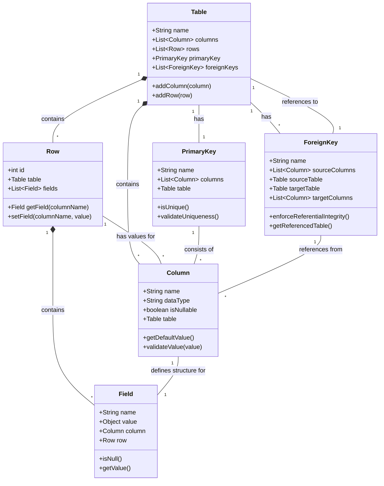

# 数据库基础（Database，DB）

## 数据库是什么

数据库简称DB。从字面上理解，数据库就是一个存储数据的库，既然都用库了，就说明有很多数据，或者说就是为了存储大量的数据而设计的。专业点讲，数据库是按照数据结构来组织、存储和管理数据的仓库，是一个长期存储在计算机内的、有组织的、可共享的、统一管理的大量数据的集合。

但我们口语中常说的“数据库”，指的是数据库管理系统 (DBMS)，即用于创建、管理和操作数据的软件，如MySQL, Oracle。

数据库在我们生活中十分常见，比如你登录某个网站的用户密码，电商平台的商品库存、订单信息等，这些数据都存储在数据库中。

## 数据库类型

### 关系型数据库(RDBMS)

关系型数据库管理系统 (RDBMS) 是一种基于关系模型（Relational Model）来组织和管理数据的软件。简而言之，它将数据存储在行 (Rows) 和 列 (Columns) 组成的表 (Tables) 中，并通过这些表之间的关系互相关联。可以看出啊，这货非常像excel表格。

数据库不是只会维护一张表的，

- 关系型数据库的术语

表 (Table)：存储数据的基本对象（例如：用户表）。

行/记录 (Row/Record)：表中的每一行代表一条具体的数据（例如：用户A 的所有信息）。

列/字段 (Column/Field)：表中的每一列代表数据的某个属性（例如：姓名、年龄、邮箱）。

主键 (Primary Key)：唯一标识表中每一行数据的字段（例如：用户ID），确保数据不重复。

外键 (Foreign Key)：用于建立两个表之间联系的字段（例如：订单表 中的 用户ID 指向 用户表 的 用户ID）。

SQL (Structured Query Language)：结构化查询语言，是与 RDBMS 交互（增删改查）的标准语言。

### 非关系型数据库(NoSQL)

- 文档型数据库

- 键值型数据库

- 列存储数据库

- 图数据库

### 其他新型数据库（不那么常见）

- 列式数据库

- 时序型数据库

- 面向对象数据库

- 多模型数据库

- 多主数据库

- 搜索引擎数据库

- 向量数据库

## 这些数据有何不同，或者说为什么要有这么多种数据库

## SQL语言

## 数据库的存储简述

## 数据库的性能优化
