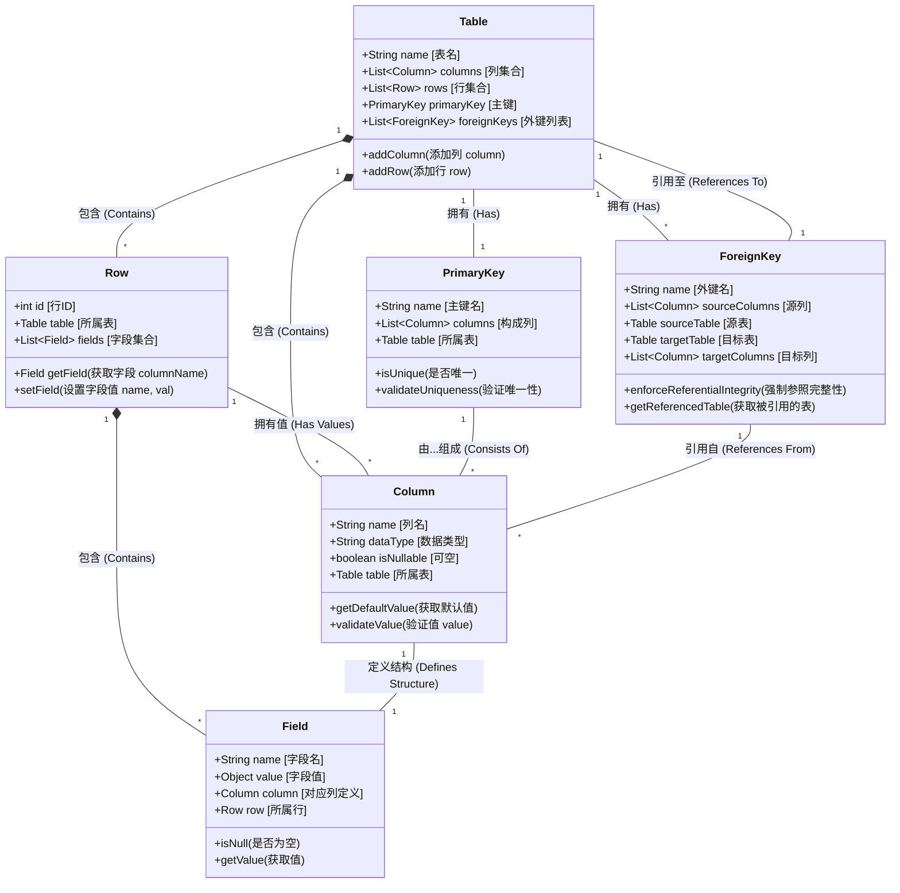

# 数据库基础（Database，DB）

## 数据库是什么

数据库简称DB。从字面上理解，数据库就是一个存储数据的库，既然都用库了，就说明有很多数据，或者说就是为了存储大量的数据而设计的。专业点讲，数据库是按照数据结构来组织、存储和管理数据的仓库，是一个长期存储在计算机内的、有组织的、可共享的、统一管理的大量数据的集合。

但我们口语中常说的“数据库”，指的是数据库管理系统 (DBMS)，即用于创建、管理和操作数据的软件，如MySQL, Oracle。

数据库在我们生活中十分常见，比如你登录某个网站的用户密码，电商平台的商品库存、订单信息等，这些数据都存储在数据库中。

## 数据库类型

### 关系型数据库(RDBMS)

关系型数据库管理系统 (RDBMS) 是一种基于关系模型（Relational Model）来组织和管理数据的软件。简而言之，它将数据存储在行 (Rows) 和 列 (Columns) 组成的表 (Tables) 中，并通过这些表之间的关系互相关联。可以看出啊，这货非常像excel表格。

- 关系型数据库的术语

表 (Table)：存储数据的基本对象。是最顶层的容器。数据库不是只会维护一张表的。可以理解为一个表就是一个Excel工作表。

行/记录 (Row/Record)：表中的每一行代表一条具体的数据，例如用户名。可以理解为Excel工作表中的一行。

列/字段 (Column/Field)：表中的每一列代表数据的某个属性,例如密码，生日，邮箱等。可以理解为Excel工作表中的一列。

主键 (Primary Key)：唯一标识表中每一行数据的字段（例如：用户ID），确保数据不重复。

外键 (Foreign Key)：前面说过于数据库不是只会维护一张表，外键可以建立两个表之间联系的字段（例如：订单表 中的 用户ID 指向 用户表 的 用户ID）。

SQL (Structured Query Language)：结构化查询语言，是与 RDBMS 交互（增删改查）的标准语言。

- 为什么需要外键和多张表

我们假设数据库需要存储一个购物订单记录。订单记录中有订单ID，购买时间，用户、商品、数量、价格，联系方式等信息。

用一张表存储信息可以得到：

|订单ID|购买时间|用户|商品|数量|价格|联系方式|地址|
| --- | --- | --- | --- | --- | --- | --- | --- |
|1|2021-01-01 10:00:00|张三|手机A|1|6999|111XXX| A地 |
|2|2021-01-02 12:00:00|春风|手机B|2|10999|222XXX| B地 |
|3|2021-01-03 14:00:00|张三|电脑A|1|14999|111XXX| A地 |
|4|2021-01-01 15:00:00|张三|手机A|1|6999|111XXX| A地 |

可以看出这张表中``张三``重复出现了3次，如果张三购买了100次，那么这张表中``张三``就会被重复记录100次，在真实环境中，数据量可达亿万条记录中，有许多的``“张三”``便会浪费了巨大的存储空间。

假如``张三``改了名，那么这张表中``张三``的记录也会跟着变，需要扫描整张百万行的表，找到所有``张三``的记录，进行修改，工作量非常大。

假设``春风``退货了，我们要删除订单2。一旦删除，由于联系方式和地址依附于这条记录，联系方式和地址便会被删除，这就造成了数据不一致。只想删订单，不想删用户，但在大表里做不到。

解决上面的问题，我们只需要把这张表拆分为3张表即可，用一个表作为主表，在主表中字段关联到其他表即可。这个关联的字段就是外键，主表为用户表，附表为订单信息表。

用户表（主表）：

|用户名|联系方式|地址|订单|
| --- | --- | --- | --- |
|张三|111XXX|A地|张三的订单表A|
|春风|222XXX|B地|春风的订单表B|

订单表A：

|订单ID|购买时间|商品|数量|价格|
| --- | --- | --- | --- | --- |
|1|2021-01-01 10:00:00|手机A|1|6999|
|2|2021-01-01 15:00:00|手机A|1|6999|
|3|2021-01-03 14:00:00|电脑A|1|14999|

订单表B：

|订单ID|购买时间|商品|数量|价格|
| --- | --- | --- | --- | --- |
|2|2021-01-02 12:00:00|手机B|2|10999|

这样的，当表中便不会重复出现``张三``，修改数据也只需要修改一条对应的记录即可，删除订单也不会影响其他数据。

还想更加深入的了解可以去看看``哈希表``相关的知识。

### 非关系型数据库(NoSQL)

在 2000 年代之前，SQL 统治一切。但随着 Google、Facebook、Amazon 的崛起，两个新问题出现了：

1. 数据量太大：传统的 SQL 数据库存在单台服务器上（就像你的电脑硬盘）。当用户从一万变到十亿，单台机器装不下了。

2. 数据结构变太快：今天我想存用户的“名字”，明天想存“头像”，后天想存“最近听的歌”。在 SQL 里，每次改结构都要“锁表”修改，导致服务暂停。

于是，NoSQL (Not Only SQL) 诞生了。它的核心哲学是：牺牲一部分“严谨性”（如事务一致性），换取极致的“速度”和“灵活性”。

NoSQL,NoSQL,就如字面一样，不是SQL。这即说明了NoSQL不是一种特定的技术，是一类数据库的统称。根据存储方式的不同，代表性的有文档型数据库，键值型数据库，列存储数据库，图数据库。

- 键值型数据库
代表：Redis, Memcached。

概念：这货就完完全全是``哈希表``了。键值型数据库只有两列，分别为Key(键)和 Value（值）。查找速度速度极快，但不支持复杂的查询。

主要用于购物车，缓存，计数器等场景。

- 文档型数据库
代表：MongoDB。

概念：文档型数据库将数据存储为一个文档，通常为JSON文档。文档中可以包含多个字段，每个字段可以有不同的类型。文档型数据库支持丰富的查询功能，但查询速度慢于键值型数据库。

主要用于：商品目录、内容管理系统（CMS）

- 列式存储数据库

代表：Cassandra, HBase。

概念：列式存储数据库是一种按列存储数据的数据库，每一列存储一个属性。查询时可以指定列，从而提高查询速度。可以理解为一种多维的、可排序的键值对映射。特别适合海量数据的批量读写和聚合分析，压缩效率高。擅长处理宽表（数十万列）

主要用于：物联网（IoT）传感器数据、Facebook 的消息记录、海量日志

- 图数据库

代表：Neo4j。

概念：图数据库存储的不是表，而是一种关系网的结构。例如``张三 --[朋友]--> 李四 --[关注]--> 王五``。他能够很好的描述元素和元素之间的关系。

主要用于：社交网络推荐（你可能认识的人）。

### 其他新型数据库（不那么常见）

- 时序型数据库

- 面向对象数据库

- 多模型数据库

- 多主数据库

- 搜索引擎数据库

- 向量数据库

## SQL语言

## 数据库的存储简述

## 数据库的性能优化
