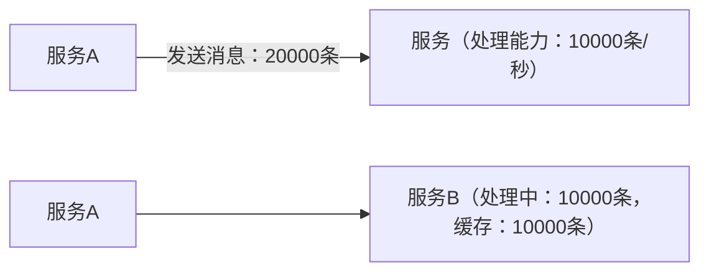
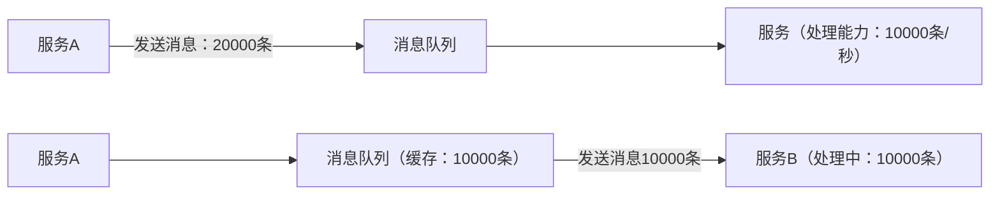

Kafka是一个消息队列，主要用于：

- 日志收集（Log aggregation）
- 实时数据流处理（Stream processing）
- 系统解耦（系统间异步通信）

### 消息队列（MQ）

消息队列一个中间件。用于将还未处理的消息缓存和软件进行解耦。实现异步通信、解耦、削峰、缓冲。

- **Broker (代理)：** 一台 Kafka 服务器。
- **Topic (主题)：** 消息的类别或“源”。您可以将其视为数据库中的一个表。
- **Partition (分区)：** Topic 可以被分成多个分区，这是 Kafka 实现高吞吐量和并行处理的关键。
- **Producer (生产者)：** 向 Kafka Topic 发布（写入）消息的应用程序。
- **Consumer (消费者)：** 订阅一个或多个 Topic 并读取（消费）消息的应用程序。
- **KRaft (Kafka Raft)：** 在较新的 Kafka 版本中（3.x 及以后），Kafka 不再需要 **ZooKeeper** 来管理其集群元数据，而是使用内置的 KRaft 协议。**本指南将使用 KRaft 模式**，因为它更简单且是未来的方向。

没有消息队列：



此时如果服务B发生错误重启，那么缓存中的10000条消息便会丢失。

增加消息队列后：



此时服务B即使发生错误重启，在消息队列中的消息也不会消失。消息队列一般都拥有很强的防重启手段，例如持久化存储。不容易发生错误重启，即使重启也可以读取回重启前的数据。

---

## kafka的安装

docker安装kafka：

找一个空的目录创建,创建docker-compose.yml文件
```bash
mkdir docker-compose-yml
cd docker-compose-yml
mkdir docker-compose.yml
``` 

编辑docker-compose.yml文件
```bash
vim docker-compose.yml
```

复制下面的内容
```yaml
    environment:
      KAFKA_BROKER_ID: 1
      KAFKA_ZOOKEEPER_CONNECT: 192.168.24.170:2181
      KAFKA_ADVERTISED_LISTENERS: PLAINTEXT://192.168.24.170:9092
      KAFKA_LISTENER_SECURITY_PROTOCOL_MAP: PLAINTEXT:PLAINTEXT
      KAFKA_LISTENERS: PLAINTEXT://0.0.0.0:9092
      KAFKA_INTER_BROKER_LISTENER_NAME: PLAINTEXT
    volumes:
      - /var/run/docker.sock:/var/run/docker.sock

  kafka2:
    image: wurstmeister/kafka:latest
    ports:
      - "9093:9093"
    environment:
      KAFKA_BROKER_ID: 2
      KAFKA_ZOOKEEPER_CONNECT: 192.168.24.170:2181
      KAFKA_ADVERTISED_LISTENERS: PLAINTEXT://192.168.24.170:9093
      KAFKA_LISTENER_SECURITY_PROTOCOL_MAP: PLAINTEXT:PLAINTEXT
      KAFKA_LISTENERS: PLAINTEXT://0.0.0.0:9093
      KAFKA_INTER_BROKER_LISTENER_NAME: PLAINTEXT
    volumes:
      - /var/run/docker.sock:/var/run/docker.sock

  kafka3:
    image: wurstmeister/kafka:latest
    ports:
      - "9094:9094"
    environment:
      KAFKA_BROKER_ID: 3
      KAFKA_ZOOKEEPER_CONNECT: 192.168.24.170:2181
      KAFKA_ADVERTISED_LISTENERS: PLAINTEXT://192.168.24.170:9094
      KAFKA_LISTENER_SECURITY_PROTOCOL_MAP: PLAINTEXT:PLAINTEXT
      KAFKA_LISTENERS: PLAINTEXT://0.0.0.0:9094
      KAFKA_INTER_BROKER_LISTENER_NAME: PLAINTEXT
    volumes:
      - /var/run/docker.sock:/var/run/docker.sock

  kafka-ui:
    image: provectuslabs/kafka-ui:latest
    ports:
      - "18080:8080"
    environment:
      KAFKA_CLUSTERS_0_NAME: "local"
      KAFKA_CLUSTERS_0_BOOTSTRAPSERVERS: "192.168.24.170:9092,192.168.24.170:9093,192.168.24.170:9094"
      KAFKA_CLUSTERS_0_ZOOKEEPER: "192.168.24.170:2181"
    depends_on:
      - kafka1
      - kafka2
      - kafka3
      - zookeeper
```
在我问AI是总是叫拉取bitnami/kafka，但由于VMware收购bitnami，将其划分为了免费版和商业版的原因。docker hub上已经没有这个镜像了。然后就是wurstmeister/zookeeper，我是怎么启动都启动不了啊。

回到正题，
推荐先下载镜像docker-compose
```bash
docker pull zookeeper:latest
docker pull wurstmeister/kafka:latest
docker pull provectuslabs/kafka-ui:latest
```
然后启动docker-compose
```bash
docker-compose up -d
```
启动后，访问http://localhost:18080/，即可看到kafka-ui管理界面。


---
## kafka-ui的使用
进入kafka-iu的管理界面如下


