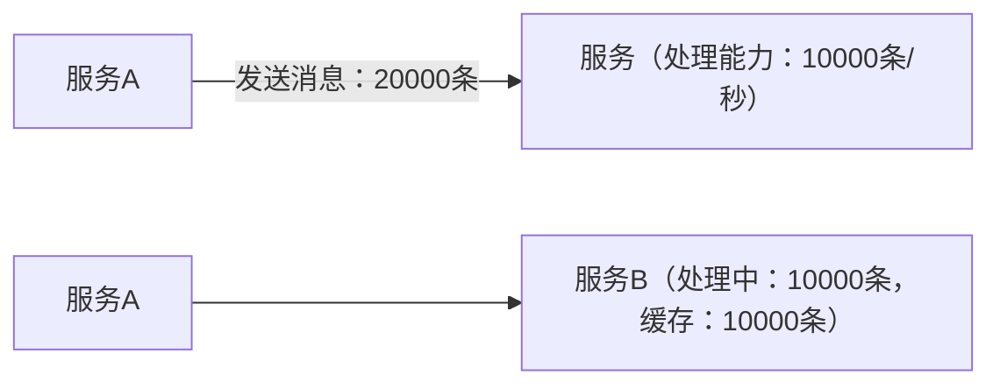
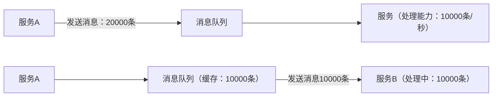
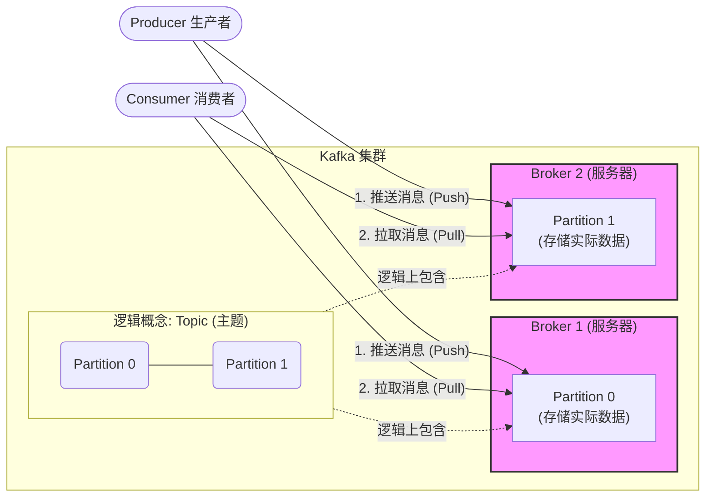
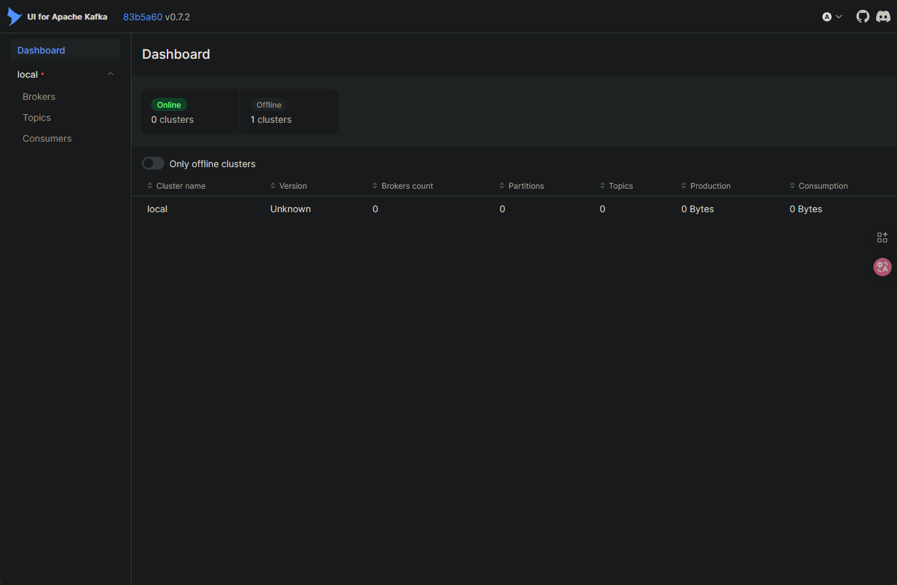

Kafka是一个消息队列，主要用于：

- 日志收集（Log aggregation）
- 实时数据流处理（Stream processing）
- 系统解耦（系统间异步通信）

## 消息队列（MQ）

消息队列一个中间件。用于将还未处理的消息缓存和软件进行解耦。实现异步通信、解耦、削峰、缓冲。

没有消息队列：



此时如果服务B发生错误重启，那么缓存中的10000条消息便会丢失。

增加消息队列后：



此时服务B即使发生错误重启，在消息队列中的消息也不会消失。消息队列一般都拥有很强的防重启手段，例如持久化存储。不容易发生错误重启，即使重启也可以读取回重启前的数据。

## Kafka中的的术语
- **Broker (代理)：** 一台 Kafka 服务器。
- **Topic (主题)：** 消息的类别或“源”。您可以将其视为数据库中的一个表。
- **Partition (分区)：** Topic 可以被分成多个分区，这是 Kafka 实现高吞吐量和并行处理的关键。
- **Producer (生产者)：** 向 Kafka Topic 发布（写入）消息的应用程序。
- **Consumer (消费者)：** 订阅一个或多个 Topic 并读取（消费）消息的应用程序。
- **KRaft (Kafka Raft)：** 在较新的 Kafka 版本中（3.x 及以后），Kafka 不再需要 **ZooKeeper** 来管理其集群元数据，而是使用内置的 KRaft 协议。**本指南将使用 KRaft 模式**，因为它更简单且是未来的方向。



---

## kafka的安装

docker安装kafka：

找一个空的目录创建,创建docker-compose.yml文件
```bash
mkdir docker-compose-yml
cd docker-compose-yml
vim docker-compose.yml
``` 

编辑docker-compose.yml文件
复制下面的内容，kafka数量可以更具自己定,改IP地址！！！！！！！！！！！！
```yaml
version: '2'
services:
  zookeeper:
    image: zookeeper:latest
    ports:
      - "2181:2181"

  kafka1:
    image: wurstmeister/kafka:latest
    ports:
      - "9092:9092"
    environment:
      KAFKA_BROKER_ID: 1
      KAFKA_ZOOKEEPER_CONNECT: 192.168.24.170:2181
      KAFKA_ADVERTISED_LISTENERS: PLAINTEXT://192.168.24.170:9092
      KAFKA_LISTENER_SECURITY_PROTOCOL_MAP: PLAINTEXT:PLAINTEXT
      KAFKA_LISTENERS: PLAINTEXT://0.0.0.0:9092
      KAFKA_INTER_BROKER_LISTENER_NAME: PLAINTEXT
    volumes:
      - /var/run/docker.sock:/var/run/docker.sock

  kafka2:
    image: wurstmeister/kafka:latest
    ports:
      - "9093:9093"
    environment:
      KAFKA_BROKER_ID: 2
      KAFKA_ZOOKEEPER_CONNECT: 192.168.24.170:2181
      KAFKA_ADVERTISED_LISTENERS: PLAINTEXT://192.168.24.170:9093
      KAFKA_LISTENER_SECURITY_PROTOCOL_MAP: PLAINTEXT:PLAINTEXT
      KAFKA_LISTENERS: PLAINTEXT://0.0.0.0:9093
      KAFKA_INTER_BROKER_LISTENER_NAME: PLAINTEXT
    volumes:
      - /var/run/docker.sock:/var/run/docker.sock

  kafka3:
    image: wurstmeister/kafka:latest
    ports:
      - "9094:9094"
    environment:
      KAFKA_BROKER_ID: 3
      KAFKA_ZOOKEEPER_CONNECT: 192.168.24.170:2181
      KAFKA_ADVERTISED_LISTENERS: PLAINTEXT://192.168.24.170:9094
      KAFKA_LISTENER_SECURITY_PROTOCOL_MAP: PLAINTEXT:PLAINTEXT
      KAFKA_LISTENERS: PLAINTEXT://0.0.0.0:9094
      KAFKA_INTER_BROKER_LISTENER_NAME: PLAINTEXT
    volumes:
      - /var/run/docker.sock:/var/run/docker.sock

  kafka-ui:
    image: provectuslabs/kafka-ui:latest
    ports:
      - "18080:8080"
    environment:
      KAFKA_CLUSTERS_0_NAME: "local"
      KAFKA_CLUSTERS_0_BOOTSTRAPSERVERS: "192.168.24.170:9092,192.168.24.170:9093,192.168.24.170:9094"
      KAFKA_CLUSTERS_0_ZOOKEEPER: "192.168.24.170:2181"
    depends_on:
      - kafka1
      - kafka2
      - kafka3
      - zookeeper

```
在我问AI是总是叫拉取bitnami/kafka，但由于VMware收购bitnami，将其划分为了免费版和商业版的原因。docker hub上已经没有这个镜像了。然后就是wurstmeister/zookeeper，我是怎么启动都启动不了啊。

回到正题，
推荐先下载镜像docker-compose
```bash
docker pull zookeeper:latest
docker pull wurstmeister/kafka:latest
docker pull provectuslabs/kafka-ui:latest
```
然后启动docker-compose
```bash
docker-compose up -d
```
启动后，访问http://localhost:18080/，即可看到kafka-ui管理界面。


---
## kafka的使用
可以使用kafka-ui管理kafka集群，进入kafka-iu的管理界面如下



仪表盘可以看到kafka集群的整体情况，包括broker的数量、topic的数量、消息的数量等。

侧边栏有三个选项卡，分别是broker管理、topic管理、消息管理。

kafka-ui的界面已经十分简洁明了，这里就不过多介绍了。
(我不想截太多的图)

下面会主要介绍kafka cil的使用。由于这里使用docker部署，所以我在所有命令前加了docker exec -it  <kafka的容器ID/名>。

``--bootstrap-server``选项指定kafka集群的地址。

### Topic管理
使用``kafka-topics.sh``命令可以对Topic进行管理。

``--create``选项可以创建一个Topic,
```bash
docker exec -it  <kafka的容器ID/名>   kafka-topics.sh \
--create \
--topic <Topic的名称> \
--partitions <分区数量> \
--replication-factor <副本数量> \
--bootstrap-server localhost:9092
```

``--list``选项可以查看kafka中已有的Topics
```bash
docker exec -it  <kafka的容器ID/名>   kafka-topics.sh \
--list \
--bootstrap-server localhost:9092
```

``--describe`` 选项可以查看 Topic 详细信息
```bash
docker exec -it  <kafka的容器ID/名>   kafka-topics.sh \
--describe \
--bootstrap-server localhost:9092 \
--topic <Topic的名称>
```

```--delete`` 选项可以删除 Topic
```bash
docker exec -it  <kafka的容器ID/名> kafka-topics.sh \
--delete \
--bootstrap-server localhost:9092 \
--topic <Topic的名称>
```

### 消息管理
使用``kafka-console-producer.sh``命令可以向Topic发布消息。

``--list``选项可以查看当前活跃的消费者
```bash
docker exec -it <kafka的容器ID/名> kafka-consumer-groups.sh \
 --list \
 --bootstrap-server localhost:9092
```

``--describe``选项可以查看消费者的详细信息
```bash
docker exec -it <kafka的容器ID/名> kafka-consumer-groups.sh \
--describe \
--bootstrap-server localhost:9092 \
--group <消费者组名称>
```

下面命令用于重置消费进度，例如想重新消费过去 1 小时的数据。(可以理解为回滚？)，重置前应当先停止该组的消费者程序。
```bash
docker exec -it kafka kafka-consumer-groups.sh \
--bootstrap-server localhost:9092 \
--group <消费者组名称> \
--reset-offsets \
--to-earliest \
--all-topics \
--execute
```

### 配置管理
使用``kafka-configs.sh``命令可以对kafka集群的配置进行管理。

``--alter``选项可以修改Topic的配置，``retention.ms=``为更改Topic 的数据保留时间，单位毫秒。``max.message.bytes``为更改Topic的最大消息大小，单位字节。
```bash
docker exec -it kafka kafka-configs.sh \
--alter \
--bootstrap-server localhost:9092 \
--entity-type topics \
--entity-name <Topic的名称> \
--add-config retention.ms=<保留时间，单位毫秒>
```

```bash
docker exec -it kafka kafka-configs.sh --alter \
  --bootstrap-server localhost:9092 \
  --entity-type topics \
  --entity-name demo \
  --add-config max.message.bytes=10485760
```


``--describe``选项可以查看Topic的动态配置信息
```bash
docker exec -it kafka kafka-configs.sh \
--describe \
--bootstrap-server localhost:9092 \
--entity-type topics \
--entity-name <Topic的名称>
```

``--delete``选项可以删除Topic的配置
```bash
docker exec -it kafka kafka-configs.sh \
--delete \
--bootstrap-server localhost:9092 \
--entity-type topics \
--entity-name <Topic的名称> \
--config retention.ms
```

## 远程集群的连接
想要远程连接到kafka集群，需要在启动kafka容器时，配置``KAFKA_ADVERTISED_LISTENERS``环境变量，指定外部访问的地址和端口。
按照上面的yml文件大概改成这样

```yaml
  kafka1:
    image: wurstmeister/kafka:latest
    ports:
      - "9092:9092"
    environment:
      KAFKA_BROKER_ID: 1
      KAFKA_ZOOKEEPER_CONNECT: 192.168.24.169:2181
      #指定外部访问的地址和端口
      KAFKA_ADVERTISED_LISTENERS: PLAINTEXT://192.168.24.69:9092,INTERNAL://192.168.24.69:29092
      KAFKA_LISTENER_SECURITY_PROTOCOL_MAP: PLAINTEXT:PLAINTEXT,INTERNAL:PLAINTEXT
      KAFKA_LISTENERS: PLAINTEXT://0.0.0.0:9092,INTERNAL://0.0.0.0:29092
      #就修改了3段
      KAFKA_INTER_BROKER_LISTENER_NAME: PLAINTEXT
    volumes:
      - /var/run/docker.sock:/var/run/docker.sock
```


## 将 Nginx 与 Kafka 关联起来
