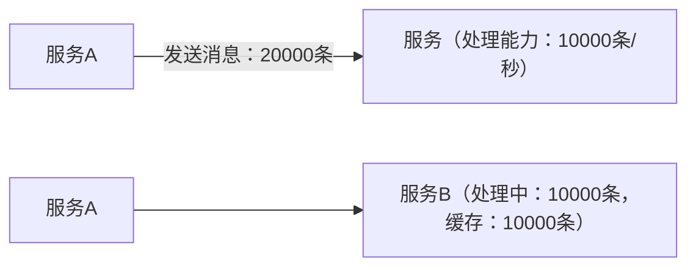
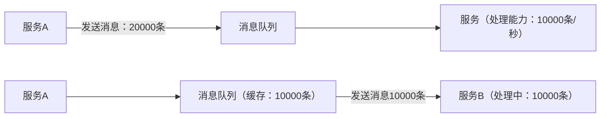

Kafka是一个消息队列，主要用于：

- 日志收集（Log aggregation）
- 实时数据流处理（Stream processing）
- 系统解耦（系统间异步通信）

### 消息队列（MQ）

消息队列一个中间件。用于将还未处理的消息缓存和软件进行解耦。实现异步通信、解耦、削峰、缓冲。

- **Broker (代理)：** 一台 Kafka 服务器。
- **Topic (主题)：** 消息的类别或“源”。您可以将其视为数据库中的一个表。
- **Partition (分区)：** Topic 可以被分成多个分区，这是 Kafka 实现高吞吐量和并行处理的关键。
- **Producer (生产者)：** 向 Kafka Topic 发布（写入）消息的应用程序。
- **Consumer (消费者)：** 订阅一个或多个 Topic 并读取（消费）消息的应用程序。
- **KRaft (Kafka Raft)：** 在较新的 Kafka 版本中（3.x 及以后），Kafka 不再需要 **ZooKeeper** 来管理其集群元数据，而是使用内置的 KRaft 协议。**本指南将使用 KRaft 模式**，因为它更简单且是未来的方向。

没有消息队列：

此时如果服务B发生错误重启，那么缓存中的10000条消息便会丢失。

增加消息队列后：

此时服务B即使发生错误重启，在消息队列中的消息也不会消失。消息队列一般都拥有很强的防重启手段，例如持久化存储。不容易发生错误重启，即使重启也可以读取回重启前的数据。

---

## kafka的安装

docker安装kafka：

[kafka集群部署 - 利用docker-compose 进行集群部署-腾讯云开发者社区-腾讯云](https://cloud.tencent.com/developer/article/2475950)

---
## kafka的web的使用
docker安装的kafka自带一个web。使用浏览器访问http://localhost:<映射端口>/即可。

