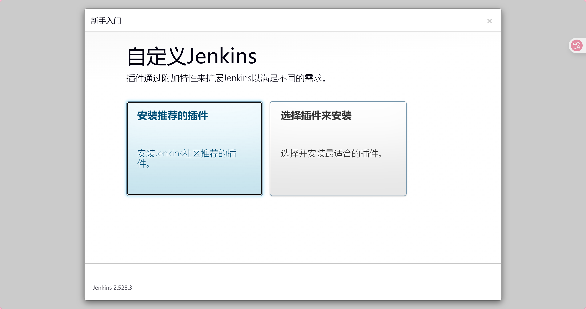
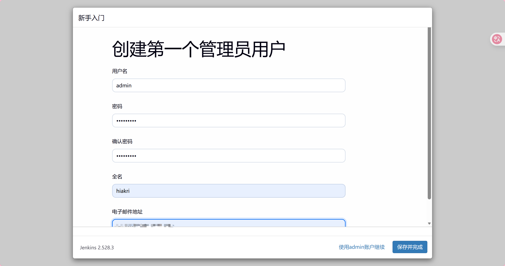
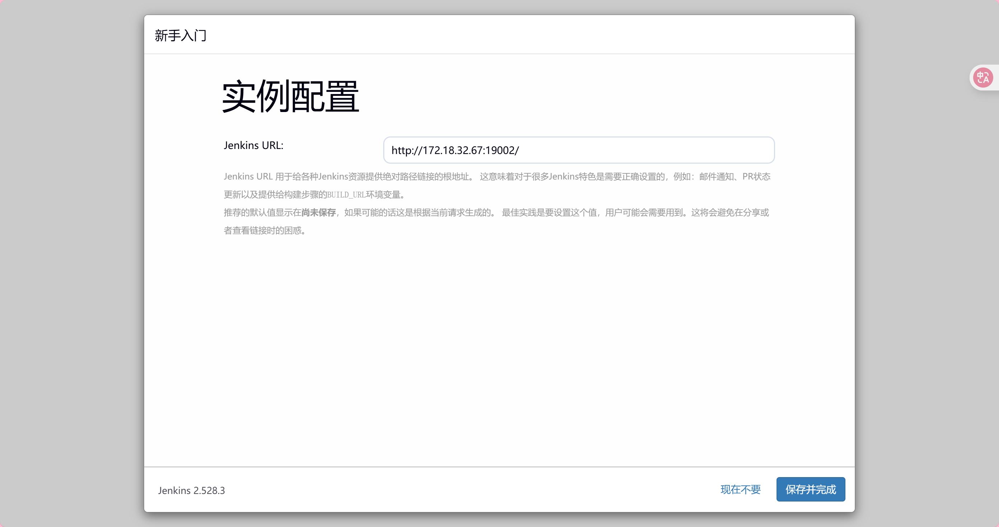
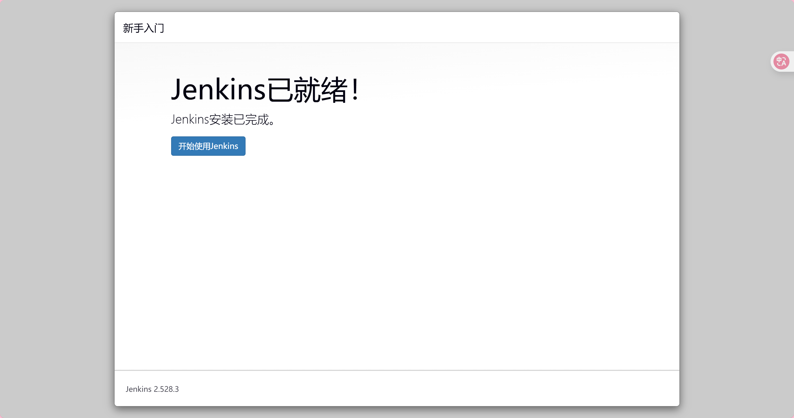

# Jenkins

Jenkins 是目前全球范围内最流行的开源自动化服务器，主要用于支持CI/CD。它可以帮助完成自动执行编译、测试、打包、部署代码的任务，从而减少人工操作的失误，提高开发效率。

本质上：Jenkins = 任务调度器 + 插件平台 + 执行引擎

- 节点 (Nodes/Agent)

jenkins采用的是``Master/Node架构``。

Master提供Web UI，负责任务的调度管理,插件，用户，权限
Node负责实际执行构建任务

- 插件 (Plugins)

Jenkins 本身只是一个框架，它的强大源于上千种插件。无论是连接 Git、Docker、Kubernetes，还是发送邮件、企业微信通知，都有对应的插件。

- 任务 (Job / Project)

Project是Jenkins的最小执行单位

## 安装

这里使用docker安装，

拉取jenkinsjiang

```bash
docker pull jenkins:lts
```

编写dockercompose

```bash
vim docker-compose_jenkins.yml
```

```bash
version: '3.8'

networks:
  jenkins:

services:
  # 自定义网络模式 可以没有值
  jenkins:
      # 指定服务使用的镜像
      image: jenkins/jenkins:lts
      # 设置容器重启策略为始终重启
      restart: always
      # 给予容器特权权限，允许进行Docker-in-Docker操作
      privileged: true
      networks:
        - jenkins
      # 设置容器环境变量
      environment:
        DOCKER_TLS_CERTDIR: /certs/client
      # 定义数据卷映射
      volumes:
        - /usr/local/jenkins/jenkins-data/certs:/certs/client:ro
        # jenkins 数据目录
        - ~/jenkins_home:/var/jenkins_home
        # 私钥目录
        - /root/jenkins/.ssh:/root/.ssh
        # 映射一个目录到宿主机指定目录，留作备份使用
        - /usr/local/jenkinsBackup:/var/jenkinsBackup
      # 定义端口映射
      ports:
        - "8080:8080"
        - "50000:50000"
      # 设置容器运行用户为root，以便有足够权限操作Docker
      user: root

```

运行dockercompose

```bash
docker compose -f docker-compose_jenkins.yaml up -d
```

访问``http://<物理机IP>:8080``访问jenkins

首次登陆需要key验证

查找key

```bash
docker exec root-jenkins-1 cat /var/jenkins_home/secrets/initialAdminPassword
```

复制回显内容粘贴到web即可

安装推荐插件



创建一个管理员用户



一般默认即可



接下来就可以使用jenkins了


